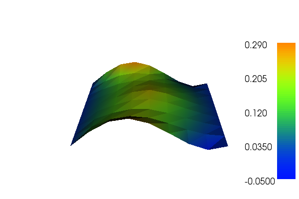

Auto adaptive Poisson equation
==============================

This demo is implemented in a single Python file,
:download:`demo_auto-adaptive-poisson.py`, which contains both the
variational forms and the solver.

In this demo we will use goal oriented adaptivity and error control
which applies a duality technique to derive error estimates taken
directly from the computed solution which then are used to weight
local residuals. To this end, we derive an :math:`\textit{a
posteriori}` error estimate and error indicators. We define a goal
functional :math:`\mathcal{M} : V \rightarrow \mathbb{R}`, which
expresses the localized physical properties of the solution of a
simulation. The objective of goal oriented adaptive error control is
to minimize computational work to obtain a given level of accuracy in
:math:`\mathcal{M}`.

We will thus illustrate how to:

* Solve a linear partial differential equation with automatic adaptive
  mesh refinement
* Define a goal functional
* Use :py:class:`AdaptiveLinearVariationalSolver
  <dolfin.cpp.fem.AdaptiveLinearVariationalSolver>`

The two solutions for u in this demo will look as follows, where the
first is the unrefined while the second is the refined solution:

.. image:: ../u_refined.png
    :scale: 75 %

Equation and problem definition
-------------------------------

The Poisson equation is the canonical elliptic partial differential
equation. For a domain :math:`\Omega \subset \mathbb{R}^n` with
boundary :math:`\partial \Omega = \Gamma_{D} \cup \Gamma_{N}`, the
Poisson equation with particular boundary conditions reads:

.. math::

    - \nabla^{2} u &= f \quad {\rm in} \ \Omega, \\
    u &= 0 \quad {\rm on} \ \Gamma_{D}, \\
    \nabla u \cdot n &= g \quad {\rm on} \ \Gamma_{N}. \\

Here, :math:`f` and :math:`g` are input data and n denotes the outward
directed boundary normal. The variational form of Poisson equation
reads: find :math:`u \in V` such that

.. math::

        a(u, v) = L(v) \quad \forall \ v \in \hat{V},

which we will call the continous primal problem, where :math:`V`,
:math:`\hat{V}` are the trial- and test spaces and

.. math::

    a(u, v) &= \int_{\Omega} \nabla u \cdot \nabla v \, {\rm d} x, \\
    L(v)    &= \int_{\Omega} f v \, {\rm d} x + \int_{\Gamma_{N}} g v \, {\rm d} s.

The expression :math:`a(u, v)` is the bilinear form and :math:`L(v)`
is the linear form. It is assumed that all functions in :math:`V`
satisfy the Dirichlet boundary conditions (:math:`u = 0 \ {\rm on} \
\Gamma_{D}`).

The above definitions is that of the continuous problem. In the actual
computer implementation we use a descrete formulation which reads:
find :math:`u \in V_h` such that

.. math::

    a(u_h, v) = L(v) \quad \forall \ v \in \hat{V}_h.

We will refer to the above equation as the discrete primal
problem. Here, :math:`V_h` and :math:`\hat{V_h}` are finite
dimensional subspaces.

The weak residual is defined as

.. math::

    r(v) = L(v) - a(u_h, v).

By the Galerkin orthogonality, we have

.. math::

    r(v) = L(v) - a(u_h, v) = a(u_h, v) -  a(u_h, v) = 0\,\, \forall v \in \hat{V}_{h},

which means that the residual vanishes for all functions in
:math:`\hat{V}_{h}`. This property is used further in the derivation
of the error estimates. wish to compute a solution :math:`u_h` to the
discrete primal problem defined above such that for a given tolerance
:math:`\mathrm{TOL}` we have

.. math::

    \eta = \left| \mathcal{M}(u_h) - \mathcal{u_h} \right| \leq \mathrm{TOL}.

Next we derive an :math:`\textit{a posteriori}` error estimate by
defining the discrete dual variational problem: find :math:`z_h \in
V_h^*` such that

.. :math::

    a^*(z_h,v) = \mathcal{v}, \quad \forall v \in \hat{V}_h^*.

Here :math:`V^*, \hat{V}_h^*` are the dual trial- and test spaces and
:math:`a^* : V^* \times \hat{V}^* \rightarrow \mathbb{R}` is the
adjoint of :math:`a` such that :math:`a^*(v,w) = a(w,v)`. We find that

.. math::

    \mathcal{M}(u - \mathcal{u_h}) = a^*(z, u - u_h) = a(u - u_h, z) = a(u,z) - a(u_h,z) = L(z) - a(u_h,z) = r(z)

and by Galerkin orthogonality we have :math:`r(z) = r(z - v_h)\,\,
\forall v_h \in \hat{V}_h`. Note that the residual vanishes if
:math:`z \in \hat{V}_h^*` and has to either be approximated in a
higher order element space or one may use an extrapolation. The choice
of goal functional depends on what quantity you are interested in.
Here, we take the goal functional to be defined as

.. math::

    \mathcal{M}(u) = \int_{\Omega}  u dx.

We use :math:`D\ddot{o}rfler` marking as the mesh marking procedure.

In this demo, we shall consider the following definitions of the input
functions, the domain, and the boundaries:

* :math:`\Omega = [0,1] \times [0,1]\,` (a unit square)
* :math:`\Gamma_{D} = \{(0, y) \cup (1, y) \subset \partial \Omega\}\,` (Dirichlet boundary)
* :math:`\Gamma_{N} = \{(x, 0) \cup (x, 1) \subset \partial \Omega\}\,` (Neumann boundary)
* :math:`g = \sin(5x)\,` (normal derivative)
* :math:`f = 10\exp(-((x - 0.5)^2 + (y - 0.5)^2) / 0.02)\,` (source term)

Implementation
--------------

This description goes through the implementation (in
:download:`demo_auto-adaptive-poisson.py`) of a solver for the above
described Poisson equation step-by-step.

First, the dolfin module is imported::

    from dolfin import *

We begin by defining a mesh of the domain and a finite element
function space V relative to this mesh. We used the built-in mesh
provided by the class :py:class:`UnitSquareMesh
<dolfin.cpp.mesh.UnitSquareMesh>`. In order to create a mesh
consisting of 8 x 8 squares with each square divided into two
triangles, we do as follows::

    # Create mesh and define function space
    mesh = UnitSquareMesh(8, 8)
    V = FunctionSpace(mesh, "Lagrange", 1)

The second argument to :py:class:`FunctionSpace
<dolfin.cpp.function.FunctionSpace>`, "Lagrange", is the finite
element family, while the third argument specifies the polynomial
degree. Thus, in this case, our space V consists of first-order,
continuous Lagrange finite element functions (or in order words,
continuous piecewise linear polynomials).

Next, we want to consider the Dirichlet boundary condition. In our
case, we want to say that the points (x, y) such that x = 0 or x = 1
are inside on the inside of :math:`\Gamma_D`. (Note that because of
rounding-off errors, it is often wise to instead specify :math:`x <
\epsilon` or :math:`x > 1 - \epsilon` where :math:`\epsilon` is a
small number (such as machine precision).) ::

    # Define boundary condition
    u0 = Function(V)
    bc = DirichletBC(V, u0, "x[0] < DOLFIN_EPS || x[0] > 1.0 - DOLFIN_EPS")

Next, we want to express the variational problem. First, we need to
specify the trial function u and the test function v, both living in
the function space V. We do this by defining a
:py:class:`TrialFunction <dolfin.functions.function.TrialFunction>`
and a :py:class:`TestFunction
<dolfin.functions.function.TestFunction>` on the previously defined
:py:class:`FunctionSpace <dolfin.cpp.function.FunctionSpace>` V.

Further, the source f and the boundary normal derivative g are
involved in the variational forms, and hence we must specify
these. Both f and g are given by simple mathematical formulas, and can
be easily declared using the :py:class:`Expression
<dolfin.cpp.function.Expression>` class. Note that the strings
defining f and g use C++ syntax since, for efficiency, DOLFIN will
generate and compile C++ code for these expressions at run-time.

With these ingredients, we can write down the bilinear form a and the
linear form L (using UFL operators). In summary, this reads::

    # Define variational problem
    u = TrialFunction(V)
    v = TestFunction(V)
    f = Expression("10*exp(-(pow(x[0] - 0.5, 2) + pow(x[1] - 0.5, 2)) / 0.02)",
                   degree=1)
    g = Expression("sin(5*x[0])", degree=1)
    a = inner(grad(u), grad(v))*dx()
    L = f*v*dx() + g*v*ds()

Now, we have specified the variational forms and can consider the
solution of the variational problem. First, we need to define a
:py:class:`Function <dolfin.cpp.function.Function>` u to represent the
solution. (Upon initialization, it is simply set to the zero
function.) A Function represents a function living in a finite element
function space. ::

    # Define function for the solution
    u = Function(V)

Then define the goal functional::

    # Define goal functional (quantity of interest)
    M = u*dx()

Next we specify the error tolerance for when the refinement shall stop::

    # Define error tolerance
    tol = 1.e-5

Now, we have specified the variational forms and can consider the
solution of the variational problem. First, we define the
:py:class:`LinearVariationalProblem
<dolfin.cpp.fem.LinearVariationalProblem>` function with the arguments
a, L, u and bc. Next we send this problem to the
:py:class:`AdaptiveLinearVariationalSolver
<dolfin.cpp.fem.AdaptiveLinearVariationalSolver>` together with the
goal functional. Note that one may also choose several adaptations in
the error control. At last we solve the problem with the defined
tolerance::

    # Solve equation a = L with respect to u and the given boundary
    # conditions, such that the estimated error (measured in M) is less
    # than tol
    problem = LinearVariationalProblem(a, L, u, bc)
    solver = AdaptiveLinearVariationalSolver(problem, M)
    solver.parameters["error_control"]["dual_variational_solver"]["linear_solver"] = "cg"
    solver.parameters["error_control"]["dual_variational_solver"]["symmetric"] = True
    solver.solve(tol)

    solver.summary()

    # Plot solution(s)
    plot(u.root_node(), title="Solution on initial mesh")
    plot(u.leaf_node(), title="Solution on final mesh")
    interactive()
