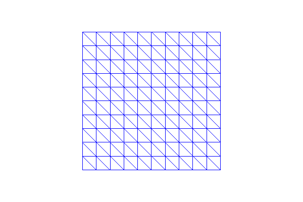
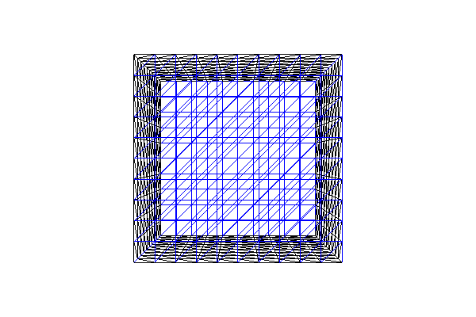

Built-in meshes
===============

This demo is implemented in a single Python file,
:download:`demo_built-in-meshes.py`, and demonstrates use of the
built-in meshes in DOLFIN.

This demo illustrates:

* How to define some of the different built-in meshes in DOLFIN

Problem definition
------------------

The demo focuses on the built-in meshes. We will look at the following
meshes:

* :py:class:`UnitIntervalMesh <dolfin.cpp.mesh.UnitIntervalMesh>`
* :py:class:`UnitSquareMesh <dolfin.cpp.mesh.UnitSquareMesh>`
* :py:class:`RectangleMesh <dolfin.cpp.mesh.RectangleMesh>`
* :py:class:`UnitCubeMesh <dolfin.cpp.mesh.UnitCubeMesh>`
* :py:class:`BoxMesh <dolfin.cpp.mesh.BoxMesh>`

Implementation
--------------

First, the :py:mod:`dolfin` module is imported::

   from dolfin import *

The first mesh we make is a mesh over the unit interval
:math:`(0,1)`. :py:class:`UnitIntervalMesh
<dolfin.cpp.mesh.UnitIntervalMesh>` takes the number of intervals
:math:`(n_x)` as input argument, and the total number of vertices is
therefore :math:`(n_x+1)`. ::

   mesh = UnitIntervalMesh(10)
   print("Plotting a UnitIntervalMesh")
   plot(mesh, title="Unit interval")

This produces a mesh looking as follows:

.. image:: unitintervalmesh.png
   :scale: 75 %

We then make our first version of a mesh on the unit square
:math:`[0,1] \times [0,1]`. We must give the number of cells in the
horizontal and vertical directions as the first two arguments to
:py:class:`UnitSquareMesh
<dolfin.cpp.generation.UnitSquareMesh>`. There is a third optional
argument that indicates the direction of the diagonals. This can be
set to "left", "right", "right/left", "left/right", or "crossed". We
can also omit this argument and thereby use the default direction
"right". ::

   mesh = UnitSquareMesh(10, 10)
   print("Plotting a UnitSquareMesh")
   plot(mesh, title="Unit square")

.. image:: unitsquaremesh.png
    :scale: 75 %

Our second version of a mesh on the unit square has diagonals to the
left, the third version has crossed diagonals and our final version
has diagonals to both left and right::

   mesh = UnitSquareMesh(10, 10, "left")
   print("Plotting a UnitSquareMesh")
   plot(mesh, title="Unit square (left)")

   mesh = UnitSquareMesh(10, 10, "crossed")
   print("Plotting a UnitSquareMesh")
   plot(mesh, title="Unit square (crossed)")

   mesh = UnitSquareMesh(10, 10, "right/left")
   print("Plotting a UnitSquareMesh")
   plot(mesh, title="Unit square (right/left)")

.. image:: unitsquaremesh_crossed.png
   :scale: 65 %

.. image:: unitsquaremesh_left_right.png
   :scale: 65 %

The class :py:class:`RectangleMesh
<dolfin.cpp.generation.RectangleMesh>` creates a mesh of a 2D
rectangle spanned by two points (opposing corners) of the rectangle.
Three additional arguments specify the number of divisions in the
:math:`x`- and :math:`y`-directions, and as above the direction of the
diagonals is given as a final optional argument ("left", "right",
"left/right", or "crossed"). In the first mesh we use the default
direction ("right") of the diagonal, and in the second mesh we use
diagonals to both left and right. ::

   mesh = RectangleMesh(Point(0.0, 0.0), Point(10.0, 4.0), 10, 10)
   print("Plotting a RectangleMesh")
   plot(mesh, title="Rectangle")

   mesh = RectangleMesh(Point(-3.0, 2.0), Point(7.0, 6.0), 10, 10, "right/left")
   print("Plotting a RectangleMesh")
   plot(mesh, title="Rectangle (right/left)")

.. image:: rectanglemesh.png
    :scale: 75 %

.. image:: rectanglemesh_left_right.png
    :scale: 75 %

To make a mesh of the 3D unit cube :math:`[0,1] \times [0,1] \times
[0,1]`, we use :py:class:`UnitCubeMesh
<dolfin.cpp.generation.UnitCubeMesh>`. :py:class:`UnitCubeMesh
<dolfin.cpp.generation.UnitCubeMesh>` takes the number of cells in the
:math:`x`-, :math:`y`- and :math:`z`-direction as the only three
arguments. ::

   mesh = UnitCubeMesh(10, 10, 10)
   print("Plotting a UnitCubeMesh")
   plot(mesh, title="Unit cube")

Finally we will demonstrate a mesh on a rectangular prism in 3D. The
prism is specified by two points (opposing corners) of the
prism. Three additional arguments specify the number of divisions in
the :math:`x`-, :math:`y`- and :math:`z`-directions.

Meshes for more complex geometries may be created using the mshr
library, which functions as a plugin to DOLFIN, providing support for
Constructive Solid Geometry (CSG) and mesh generation. For more
details, refer to the mshr documentation. ::

   mesh = BoxMesh(Point(0.0, 0.0, 0.0), Point(10.0, 4.0, 2.0), 10, 10, 10)
   print("Plotting a BoxMesh")
   plot(mesh, title="Box")

.. image:: boxmesh.png
   :scale: 75 %

By calling :py:meth:`interactive
<dolfin.cpp.io.VTKPlotter.interactive>` we are allowed to resize, move
and rotate the plots. ::

   interactive()
