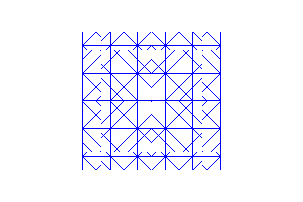
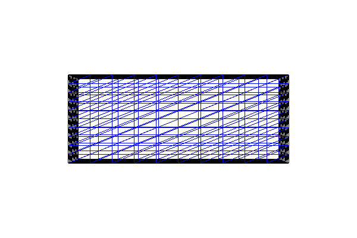

.. Documentation for the built-in_meshes demo from DOLFIN.

.. _demo_pde_built-in_meshes_python_documentation:

Built-in meshes
====================

This demo is implemented in a single Python file,
:download:`demo_built-in.py`, and demonstrates use of the built-in
meshes in DOLFIN.

.. include:: ../common.txt

Implementation
--------------

First, the :py:mod:`dolfin` module is imported:

.. code-block:: python

   from dolfin import *

The first mesh we make is a mesh over the unit interval
:math:`(0,1)`. :py:class:`UnitIntervalMesh
<dolfin.cpp.mesh.UnitIntervalMesh>` takes the number of intervals
:math:`(n_x)` as input argument, and the total number of vertices is
therefore :math:`(n_x+1)`.

.. code-block:: python

   mesh = UnitIntervalMesh(10)
   print "Plotting a UnitIntervalMesh"
   plot(mesh, title="Unit interval")

This produces a mesh looking as follows:

.. image:: unitintervalmesh.png
   :scale: 75 %

We then make our first version of a mesh on the unit square
:math:`[0,1] \times [0,1]`. We must give the number of cells in the
horizontal and vertical directions as the first two arguments to
:py:class:`UnitSquareMesh
<dolfin.cpp.generation.UnitSquareMesh>`. There is a third optional
argument that indicates the direction of the diagonals. This can be
set to "left", "right", "right/left", "left/right", or "crossed". We
can also omit this argument and thereby use the default direction
"right".

.. code-block:: python

   mesh = UnitSquareMesh(10, 10)
   print "Plotting a UnitSquareMesh"
   plot(mesh, title="Unit square")

.. image:: unitsquaremesh.png
	:scale: 75 %

Our second version of a mesh on the unit square has diagonals to the
left, the third version has crossed diagonals and our final version
has diagonals to both left and right:

.. code-block:: python

   mesh = UnitSquareMesh(10, 10, "left")
   print "Plotting a UnitSquareMesh"
   plot(mesh, title="Unit square (left)")

   mesh = UnitSquareMesh(10, 10, "crossed")
   print "Plotting a UnitSquareMesh"
   plot(mesh, title="Unit square (crossed)")

   mesh = UnitSquareMesh(10, 10, "right/left")
   print "Plotting a UnitSquareMesh"
   plot(mesh, title="Unit square (right/left)")

.. image:: unitsquaremesh_left.png
   :scale: 65 %

.. image:: unitsquaremesh_left_right.png
   :scale: 65 %

The class :py:class:`RectangleMesh
<dolfin.cpp.generation.RectangleMesh>`
(:math:`x_0,y_0,x_1,y_1,n_x,n_y`, direction) creates a mesh on a
rectangle with one corner in :math:`(x_0,y_0)` and the opposite corner
in :math:`(x_1,y_1)`. :math:`n_x` and :math:`n_y` specify the number
of cells in the :math:`x`- and :math:`y`-directions, and as above the
direction of the diagonals is given as a final optional argument
("left", "right", "left/right", or "crossed"). In the first mesh we
use the default direction ("right") of the diagonal, and in the second
mesh we use diagonals to both left and right.

.. code-block:: python

   mesh = RectangleMesh(0.0, 0.0, 10.0, 4.0, 10, 10)
   print "Plotting a RectangleMesh"
   plot(mesh, title="Rectangle")

   mesh = RectangleMesh(-3.0, 2.0, 7.0, 6.0, 10, 10, "right/left")
   print "Plotting a RectangleMesh"
   plot(mesh, title="Rectangle (right/left)")

.. image:: rectanglemesh.png
	:scale: 75 %

.. image:: rectanglemesh_left_right.png
	:scale: 75 %

Unstructured ellipsoid and ellipse meshes can be created if DOLFIN is
configured with CGAL.  Using :py:class:`CircleMesh
<dolfin.cpp.generation.CircleMesh>` For a circle centered at (0, 0)
with radius 1 and cell size 0.2:

.. code-block:: python

    mesh = CircleMesh(Point(0.0, 0.0), 1.0, 0.2)
    print "Plotting a CircleMesh"
    plot(mesh, title="Circle (unstructured)")

Using :py:class:`EllipseMesh <dolfin.cpp.generation.EllipseMesh>` for
an ellipse centered at (0, 0) with 'radii' of 3 and 1 in the
:math:`x`- and :math:`y` directions, respectively, and cell size 0.2:

.. code-block:: python

   mesh = EllipseMesh(Point(0.0, 0.0), [3.0, 1.0], 0.2)
   print "Plotting an EllipseMesh"
   plot(mesh, title="Ellipse mesh (unstructured)")

Using :py:class:`SphereMesh <dolfin.cpp.generation.SphereMesh>` for a
sphere centered at (0, 0, 0) with radius 1 and cell size 0.2:

.. code-block:: python

   mesh = SphereMesh(Point(0.0, 0.0, 0.0), 1.0, 0.2)
   print "Plotting a SphereMesh"
   plot(mesh, title="Sphere mesh (unstructured)")

Using :py:class:`EllipsoidMesh <dolfin.cpp.generation.EllipsoidMesh>`
For an ellipsoid centered at (0, 0, 0.0), with 'radii' of 3, 1 and 2
in the :math:`x`-, :math:`y` and :math`z`-directions, respectively,
and cell size 0.2:

.. code-block:: python

   mesh = EllipsoidMesh(Point(0.0, 0.0, 0.0), [3.0, 1.0, 2.0], 0.2)
   print "Plotting an EllipsoidMesh"
   plot(mesh, title="Ellipsoid mesh (unstructured)")

To make a mesh of the 3D unit cube :math:`[0,1] \times [0,1] \times
[0,1]`, we use :py:class:`UnitCubeMesh
<dolfin.cpp.generation.UnitCubeMesh>`. :py:class:`UnitCubeMesh
<dolfin.cpp.generation.UnitCubeMesh>` takes the number of cells in the
:math:`x`-, :math:`y`- and :math:`z`-direction as the only three
arguments.

.. code-block:: python

   mesh = UnitCubeMesh(10, 10, 10)
   print "Plotting a UnitCubeMesh"
   plot(mesh, title="Unit cube")

.. image:: unitcubemesh.png
   :scale: 75 %

Finally we will demonstrate a mesh on a rectangular prism in
3D. :py:class:`BoxMesh <dolfin.cpp.generation.BoxMesh>`
(:math:`x_0,y_0,z_0,x_1,y_1,z_1,x_n,y_n,z_n`) takes the coordinates of
the first corner(:math:`x_0,y_0,z_0`) as the three first arguments,
the coordinates of the opposite corner (:math:`x_1,y_1,z_1`) as the
next three arguments, while the last three arguments specify the
number of points in the :math:`x`-, :math:`y`- and
:math:`z`-direction.

.. code-block:: python

   mesh = BoxMesh(0.0, 0.0, 0.0, 10.0, 4.0, 2.0, 10, 10, 10)
   print "Plotting a BoxMesh"
   plot(mesh, title="Box")

By calling :py:meth:`interactive
<dolfin.cpp.io.VTKPlotter.interactive>` we are allowed to resize, move
and rotate the plots.

.. code-block:: python

   interactive()

Complete code
-------------

.. literalinclude:: demo_built-in.py
   :start-after: # Begin demo
