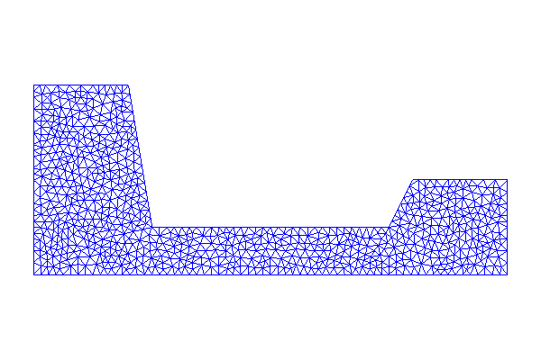
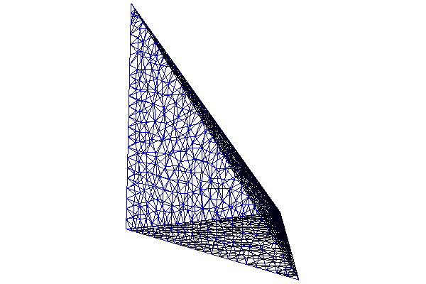
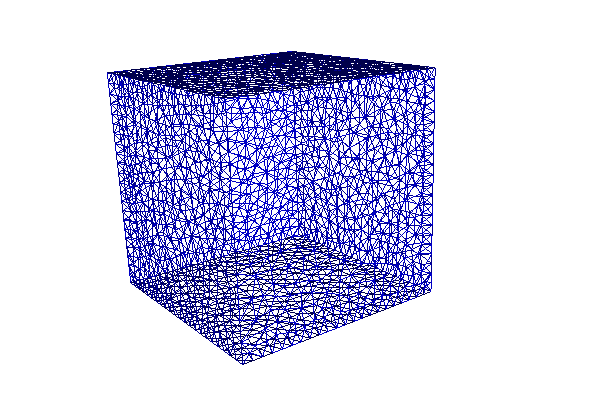

.. Documentation for the mesh generation demo from DOLFIN.

.. _demo_pde_mesh-generation_python_documentation:

Generate mesh
=============

This demo is implemented in a single Python file,
:download:`demo_mesh_generaton.py`, and the 3D geometries are
described in two ``.off`` file (Object File Format), ``tetrahedron.off`` and
``cube.off``.

.. include:: ../common.txt

Implementation
--------------

First, the :py:mod:`dolfin` module is imported:

.. code-block:: python

    from dolfin import *

:py:class:`PolygonalMeshGenerator <dolfin.cpp.mesh.PolygonalMeshGenerator>` and
:py:class:`PolyhedralMeshGenerator <dolfin.cpp.mesh.PolyhedralMeshGenerator>` need CGAL to generate
    the meshes, so we check that DOLFIN is compiled with CGAL.

.. code-block:: python

	if not has_cgal():
	    print "DOLFIN must be compiled with CGAL to run this demo."
	    exit(0)

We create an empty mesh using :py:class:`Mesh
<dolfin.cpp.mesh.Mesh>`. We need this mesh as an argument to
:py:class:`PolygonalMeshGenerator
<dolfin.cpp.mesh.PolygonalMeshGenerator>` and
:py:class:`PolyhedralMeshGenerator
<dolfin.cpp.mesh.PolyhedralMeshGenerator>`.

.. code-block:: python

	# Create empty Mesh
	mesh = Mesh()

We are now ready to make the geometries. We start with a polygon and
define it by making a list of its vertices. We need a closed contour,
so the first and the last element in the list is the same point. We
represent the points with instances of :py:class:`Point
<dolfin.cpp.mesh.Point>`. :py:class:`Point <dolfin.cpp.mesh.Point>`
takes :math:`(x,y,z)` as arguments, but since they all have default
value 0, and we have a 2D-geometry, we can omit :math:`z`.

.. code-block:: python

	# Create list of polygonal domain vertices
	domain_vertices = [Point(0.0, 0.0),
		           Point(10.0, 0.0),
		           Point(10.0, 2.0),
		           Point(8.0, 2.0),
		           Point(7.5, 1.0),
		           Point(2.5, 1.0),
		           Point(2.0, 4.0),
		           Point(0.0, 4.0),
		           Point(0.0, 0.0)]

We send our list of points to :py:class:`PolygonalMeshGenerator
<dolfin.cpp.mesh.PolygonalMeshGenerator>` along with the empty mesh
and the cell size. The cell size decides the resolution of the
mesh. We set interactive to True so that we are able to rotate, resize
and translate the mesh.

.. code-block:: python

	# Generate mesh and plot
	PolygonalMeshGenerator.generate(mesh, domain_vertices, 0.25);
	plot(mesh, interactive=True)

The geometry for the next two meshes are described by .off-files. It
is easy to make off-files, so we will go through the four parts of the
files:

* The first line is just OFF
* The second line consist of three numbers: the first one is the
  number of vertices, the second is the number of faces and the third
  is the number of edges. The number of edges will not be used so we
  set it to 0.
* On line three we start listing the vertices, one vertex is described
  by its coordinates (three numbers) on each line.
* The last part of the file describes the faces (facets, sides) of the
  geometry. One face is described on one line where the first number
  says how many vertices we need to represent the face (in a cube we
  need four, but in a tetrahedron we need three). We then list the
  vertices describing the face. We use the vertices defined above and
  start our "indexing" at 0.

::

	OFF
	Number_of_vertices(n) Number_of_faces(q) Number_of_edges
	x1 y1 z1
	x2 y2 z2
	...
	...
	xn yn zn
	number_of_vertices_on_face_1(m) vertex_1 vertex_2 vertex_3 ... vertex_m
	number_of_vertices_on_face_2(k) vertex_1 vertex_2 vertex_3 ... vertex_k
	number_of_vertices_on_face_3(l) vertex_1 vertex_2 vertex_3 ... vertex_l
	...
	...
	number_of_vertices_on_face_q(i) vertex_1 vertex_2 vertex_3 ... vertex_i

We send the empty mesh, the off-file and the resolution (cell size) to
:py:class:`PolyhedralMeshGenerator
<dolfin.cpp.mesh.PolyhedralMeshGenerator>`

.. code-block:: python

	# Generate 3D mesh from OFF file input (tetrahedron)
	PolyhedralMeshGenerator.generate(mesh, "../tetrahedron.off", 0.05)
	plot(mesh, interactive=True)

	# Generate 3D mesh from OFF file input (cube)
	PolyhedralMeshGenerator.generate(mesh, "../cube.off", 0.05)
	plot(mesh, interactive=True)

Complete code
-------------

.. literalinclude:: demo_mesh_generation.py
   :start-after: # Begin demo
