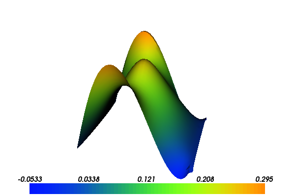

Mixed formulation for Poisson equation (C++)
============================================

This demo illustrates how to solve Poisson equation using a mixed
(two-field) formulation. In particular, it illustrates how to

* Use mixed and non-continuous finite element spaces
* Set essential boundary conditions for subspaces and H(div) spaces
* Define a (vector-valued) expression using additional geometry information

Equation and problem definition
-------------------------------

An alternative formulation of Poisson equation can be formulated by
introducing an additional (vector) variable, namely the (negative)
flux: :math:`\sigma = \nabla u`. The partial differential equations
then read

.. math::
   \sigma - \nabla u &= 0 \quad {\rm in} \ \Omega, \\
   \nabla \cdot \sigma &= - f \quad {\rm in} \ \Omega,

with boundary conditions

.. math::
   u = u_0 \quad {\rm on} \ \Gamma_{D},  \\
   \sigma \cdot n = g \quad {\rm on} \ \Gamma_{N}.

The same equations arise in connection with flow in porous media, and
are also referred to as Darcy flow.

After multiplying by test functions :math:`\tau` and :math:`v`,
integrating over the domain, and integrating the gradient term by
parts, one obtains the following variational formulation: find
:math:`\sigma \in \Sigma` and :math:`v \in V` satisfying

.. math::
   \int_{\Omega} (\sigma \cdot \tau + \nabla \cdot \tau \ u) \ {\rm d} x
   &= \int_{\Gamma} \tau \cdot n \ u \ {\rm d} s
   \quad \forall \ \tau \in \Sigma, \\

   \int_{\Omega} \nabla \cdot \sigma v \ {\rm d} x
   &= - \int_{\Omega} f \ v \ {\rm d} x
   \quad \forall \ v \in V.

Here :math:`n` denotes the outward pointing normal vector on the
boundary. Looking at the variational form, we see that the boundary
condition for the flux (:math:`\sigma \cdot n = g`) is now an
essential boundary condition (which should be enforced in the function
space), while the other boundary condition (:math:`u = u_0`) is a
natural boundary condition (which should be applied to the variational
form). Inserting the boundary conditions, this variational problem can
be phrased in the general form: find :math:`(\sigma, u) \in \Sigma_g
\times V` such that

.. math::

   a((\sigma, u), (\tau, v)) = L((\tau, v))
   \quad \forall \ (\tau, v) \in \Sigma_0 \times V

where the variational forms :math:`a` and :math:`L` are defined as

.. math::

   a((\sigma, u), (\tau, v)) &=
     \int_{\Omega} \sigma \cdot \tau + \nabla \cdot \tau \ u
   + \nabla \cdot \sigma \ v \ {\rm d} x \\
   L((\tau, v)) &= - \int_{\Omega} f v \ {\rm d} x
   + \int_{\Gamma_D} u_0 \tau \cdot n  \ {\rm d} s

and :math:`\Sigma_g = \{ \tau \in H({\rm div}) \text{ such that } \tau \cdot n|_{\Gamma_N} = g \}`
and :math:`V = L^2(\Omega)`.

To discretize the above formulation, two discrete function spaces
:math:`\Sigma_h \subset \Sigma` and :math:`V_h \subset V` are needed
to form a mixed function space :math:`\Sigma_h \times V_h`. A stable
choice of finite element spaces is to let :math:`\Sigma_h` be the
Brezzi-Douglas-Marini elements of polynomial order :math:`k` and let
:math:`V_h` be discontinuous elements of polynomial order :math:`k-1`.

We will use the same definitions of functions and boundaries as in the
demo for Poisson's equation. These are:

* :math:`\Omega = [0,1] \times [0,1]` (a unit square)
* :math:`\Gamma_{D} = \{(0, y) \cup (1, y) \in \partial \Omega\}`
* :math:`\Gamma_{N} = \{(x, 0) \cup (x, 1) \in \partial \Omega\}`
* :math:`u_0 = 0`
* :math:`g = \sin(5x)`   (flux)
* :math:`f = 10\exp(-((x - 0.5)^2 + (y - 0.5)^2) / 0.02)`   (source term)

With the above input the solution for :math:`u` and :math:`\sigma` will look as
follows:

.. image:: ../mixed-poisson_sigma.png
    :scale: 75
    :align: center

.. todo:: Fix the links to images

Implementation
--------------

The implementation is split in two files, a form file containing the definition
of the variational forms expressed in UFL and the solver which is implemented
in a C++ file.

Running this demo requires the files: :download:`main.cpp`,
:download:`MixedPoisson.ufl` and :download:`CMakeLists.txt`.

UFL form file
^^^^^^^^^^^^^

The UFL file is implemented in :download:`MixedPoisson.ufl`, and the
explanation of the UFL file can be found at :doc:`here <MixedPoisson.ufl>`.

C++ program
^^^^^^^^^^^

The solver is implemented in the :download:`main.cpp` file.

At the top we include the DOLFIN header file and the generated header
file containing the variational forms.  For convenience we also
include the DOLFIN namespace.

.. code-block:: cpp

   #include <dolfin.h>
   #include "MixedPoisson.h"

   using namespace dolfin;

Then follows the definition of the coefficient functions (for
:math:`f` and :math:`G`), which are derived from the DOLFIN
:cpp:class:`Expression` class.

.. code-block:: cpp

   // Source term (right-hand side)
   class Source : public Expression
   {
     void eval(Array<double>& values, const Array<double>& x) const
     {
       double dx = x[0] - 0.5;
       double dy = x[1] - 0.5;
       values[0] = 10*exp(-(dx*dx + dy*dy) / 0.02);
     }
   };

   // Boundary source for flux boundary condition
   class BoundarySource : public Expression
   {
   public:

     BoundarySource(const Mesh& mesh) : Expression(2), mesh(mesh) {}

     void eval(Array<double>& values, const Array<double>& x,
               const ufc::cell& ufc_cell) const
     {
       dolfin_assert(ufc_cell.local_facet >= 0);

       Cell cell(mesh, ufc_cell.index);
       Point n = cell.normal(ufc_cell.local_facet);

       const double g = sin(5*x[0]);
       values[0] = g*n[0];
       values[1] = g*n[1];
     }

   private:

     const Mesh& mesh;

   };

Then follows the definition of the essential boundary part of the
boundary of the domain, which is derived from the
:cpp:class:`SubDomain` class.

.. code-block:: cpp

   // Sub domain for essential boundary condition
   class EssentialBoundary : public SubDomain
   {
     bool inside(const Array<double>& x, bool on_boundary) const
     {
       return x[1] < DOLFIN_EPS or x[1] > 1.0 - DOLFIN_EPS;
     }
   };

Inside the ``main()`` function we first create the ``mesh`` and then
we define the (mixed) function space for the variational
formulation. We also define the bilinear form ``a`` and linear form
``L`` relative to this function space.

.. code-block:: cpp

   int main()
   {
     // Create mesh
     auto mesh = std::make_shared<UnitSquareMesh>(32, 32);

     // Construct function space
     auto W = std::make_shared<MixedPoisson::FunctionSpace>(mesh);
     MixedPoisson::BilinearForm a(W, W);
     MixedPoisson::LinearForm L(W);

Then we create the source (:math:`f`) and assign it to the linear form.

.. code-block:: cpp

     // Create source and assign to L
     auto f = std::make_shared<Source>();
     L.f = f;

It only remains to prescribe the boundary condition for the
flux. Essential boundary conditions are specified through the class
:cpp:class:`DirichletBC` which takes three arguments: the function
space the boundary condition is supposed to be applied to, the data
for the boundary condition, and the relevant part of the boundary.

We want to apply the boundary condition to the first subspace of the
mixed space. This space can be accessed through the `sub` member
function of the :cpp:class:`FunctionSpace` class.

Next, we need to construct the data for the boundary condition. An
essential boundary condition is handled by replacing degrees of
freedom by the degrees of freedom evaluated at the given data. The
:math:`BDM` finite element spaces are vector-valued spaces and hence
the degrees of freedom act on vector-valued objects. The effect is
that the user is required to construct a :math:`G` such that :math:`G
\cdot n = g`.  Such a :math:`G` can be constructed by letting :math:`G
= g n`. This is what the derived expression class ``BoundarySource``
defined above does.

.. code-block:: cpp

     // Define boundary condition
     auto G = std::make_shared<BoundarySource>(*mesh);
     auto boundary = std::make_shared<EssentialBoundary>();
     DirichletBC bc(W->sub(0), G, boundary);

To compute the solution we use the bilinear and linear forms, and the
boundary condition, but we also need to create a :cpp:class:`Function`
to store the solution(s). The (full) solution will be stored in the
:cpp:class:`Function` ``w``, which we initialise using the
:cpp:class:`FunctionSpace` ``W``. The actual computation is performed
by calling ``solve``.

.. code-block:: cpp

     // Compute solution
     Function w(W);
     solve(a == L, w, bc);

Now, the separate components ``sigma`` and ``u`` of the solution can
be extracted by taking components. These can easily be visualized by
calling ``plot``.

.. code-block:: cpp

     // Extract sub functions (function views)
     Function& sigma = w[0];
     Function& u = w[1];

     // Plot solutions
     plot(u);
     plot(sigma);
     interactive();

     return 0;
   }
