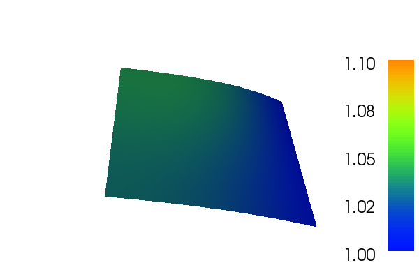
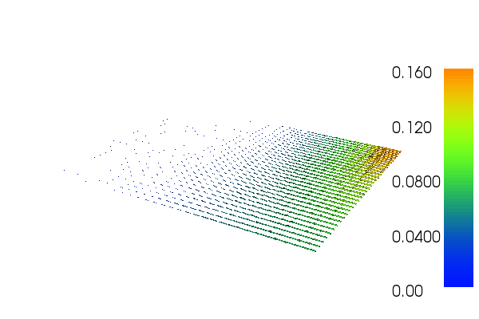

.. _demo_nonlinear_poisson:

Nonlinear Poisson equation
==========================

This demo is implemented in a single Python file,
:download:`demo_nonlinear-poisson.py`, which contains both the
variational form and the solver.

This demo illustrates how to:

* Solve a nonlinear partial differential equation (in this case a
  nonlinear variant of Poisson's equation)
* Create and apply Dirichlet boundary conditions
* Define an :py:class:`Expression <dolfin.cpp.function.Expression>`
* Define a :py:class:`FunctionSpace <dolfin.cpp.function.FunctionSpace>`
* Create a :py:class:`SubDomain <dolfin.cpp.mesh.SubDomain>`

The solution for :math:`u` in this demo will look as follows:

and the gradient of :math:`u` will look like this:

Equation and problem definition
-------------------------------

For a domain :math:`\Omega \subset \mathbb{R}^N` with boundary
:math:`\partial \Omega = \Gamma_{D} \cup \Gamma_{N}`, we consider the
following nonlinear Poisson equation with given boundary conditions:

.. math::n

    - \nabla\cdot((1 + u^2) \nabla u) &= f \quad {\rm in}\, \Omega,\\
    u &= 1  \quad  {\rm on}\, \Gamma_D,\\
    \nabla u\cdot n &= 0 \quad  {\rm on}\, \Gamma_N.

Here :math:`f` is input data and :math:`n` denotes the outward
directed boundary normal. The nonlinear variational form can be
written in the following canonical form: find :math:`u \in V` such
that

.. math::

   F(u;v) = 0 \quad \forall \, v \in \hat{V}

Here :math:`F:V\times\hat{V}\rightarrow\mathbb{R}` is a semilinear
form, linear in the argument subsequent to the semicolon, and
:math:`V` is some suitable function space. The semilinear form is
defined as follows:

.. math::

   F(u;v) = \int_\Omega (1 + u^2)\cdot\nabla u \cdot \nabla v - f v \,{\rm dx} = 0.

To solve the nonlinear system :math:`b(U) = 0` by Newton's method we
compute the Jacobian :math:`A = b'`, where :math:`U` is the
coefficients of the linear combination in the finite element solution
:math:`u_h = \sum_{j=1}^{N}U_j\phi_j, \;
b:\mathbb{R}^N\rightarrow\mathbb{R}^N` and

.. math::

   b_i(U) = F(u_h;\hat{\phi}_i),\quad i = 1,2,\dotsc,N.

Linearizing the semilinear form :math:`F` around :math:`u = u_h`, we obtain

.. math::

   F'(u_h;\delta u,v) = \int_\Omega [(2 \delta u\nabla u_h)\cdot\nabla v + ((1+u_h^2)\nabla\delta u)\nabla v] \,{\rm dx}

We note that for each fixed :math:`u_h`, :math:`a =
F'(u_h;\,\cdot\,,\,\cdot\,)` is a bilinear form and :math:`L =
F(u_h;\,\cdot\,,\,\cdot\,)` is a linear form. In each Newton
iteration, we thus solve a linear variational problem of the canonical
form: find :math:`\delta u \in V_{h,0}` such that

.. math::

   F'(u_h;\delta u,v) = -F(u_h;v)\quad\forall\,v\in\hat{V}_h.

In this demo, we shall consider the following definitions of the input
function, the domain, and the boundaries:

* :math:`\Omega = [0,1] \times [0,1]\,\,\,` (a unit square)
* :math:`\Gamma_{D} = \{(1, y) \subset \partial \Omega\}\,\,\,` (Dirichlet boundary)
* :math:`\Gamma_{N} = \{(x, 0) \cup (x, 1) \cup (0, y) \subset \partial \Omega\}\,\,\,` (Neumann boundary)
* :math:`f(x, y) = x\sin(y)\,\,\,` (source term)

Implementation
--------------

This description goes through the implementation (in
:download:`demo_nonlinear-poisson.py`) of a solver for the above
described nonlinear Poisson equation step-by-step.

First, the :py:mod:`dolfin` module is imported::

    from dolfin import *

Next, we want to consider the Dirichlet boundary condition. A simple
Python function, returning a boolean, can be used to define the
subdomain for the Dirichlet boundary condition (:math:`\Gamma_D`). The
function should return True for those points inside the subdomain and
False for the points outside. In our case, we want to say that the
points :math:`(x, y)` such that :math:`x = 1` are inside on the inside
of :math:`\Gamma_D`. (Note that because of rounding-off errors, it is
often wise to instead specify :math:`|x - 1| < \epsilon`, where
:math:`\epsilon` is a small number (such as machine precision).)::

    # Sub domain for Dirichlet boundary condition
    class DirichletBoundary(SubDomain):
        def inside(self, x, on_boundary):
            return abs(x[0] - 1.0) < DOLFIN_EPS and on_boundary

We then define a mesh of the domain and a finite element function
space V relative to this mesh. We use the built-in mesh provided by
the class :py:class:`UnitSquareMesh
<dolfin.cpp.mesh.UnitSquareMesh>`. In order to create a mesh
consisting of :math:`32 \times 32` squares with each square divided
into two triangles, we do as follows::

    # Create mesh and define function space
    mesh = UnitSquareMesh(32, 32)
    File("mesh.pvd") << mesh

    V = FunctionSpace(mesh, "CG", 1)

The second argument to :py:class:`FunctionSpace
<dolfin.cpp.function.FunctionSpace>` is the finite element family,
while the third argument specifies the polynomial degree. Thus, in
this case, we use 'CG', for Continuous Galerkin, as a synonym for
'Lagrange'. With degree 1, we simply get the standard linear Lagrange
element, which is a triangle with nodes at the three vertices (or in
other words, continuous piecewise linear polynomials).

The Dirichlet boundary condition can be created using the class
:py:class:`DirichletBC <dolfin.cpp.fem.DirichletBC>`. A
:py:class:`DirichletBC <dolfin.cpp.fem.DirichletBC>` takes three
arguments: the function space the boundary condition applies to, the
value of the boundary condition, and the part of the boundary on which
the condition applies. In our example, the function space is V, the
value of the boundary condition (1.0) can be represented using a
Constant and the Dirichlet boundary is defined above. The definition
of the Dirichlet boundary condition then looks as follows::

    # Define boundary condition
    g = Constant(1.0)
    bc = DirichletBC(V, g, DirichletBoundary())

Next, we want to express the variational problem. First, we need to
specify the function u which represents the solution. Upon
initialization, it is simply set to the zero function, which will
represent the initial guess :math:`u_0`. A :py:class:`Function
<dolfin.cpp.function.Function>` represents a function living in a
finite element function space. The test function :math:`v` is
specified, also living in the function space :math:`V`. We do this by
defining a :py:class:`Function <dolfin.cpp.function.Function>` and a
:py:class:`TestFunction <dolfin.functions.function.TestFunction>` on
the previously defined :py:class:`FunctionSpace
<dolfin.cpp.function.FunctionSpace>` V.

Further, the source :math:`f` is involved in the variational forms,
and hence we must specify this. We have :math:`f` given by a simple
mathematical formula, which can be easily declared using the
:py:class:`Expression <dolfin.cpp.function.Expression>` class. Note
that the strings defining f use C++ syntax since, for efficiency,
DOLFIN will generate and compile C++ code for this expression at
run-time.

By defining the function in this step and omitting the trial function
we tell FEniCS that the problem is nonlinear. With these ingredients,
we can write down the semilinear form F (using UFL operators). In
summary, this reads::

    # Define variational problem
    u = Function(V)
    v = TestFunction(V)
    f = Expression("x[0]*sin(x[1])", degree=2)
    F = inner((1 + u**2)*grad(u), grad(v))*dx - f*v*dx

Now, we have specified the variational forms and can consider the
solution of the variational problem.  Next, we can call the solve
function with the arguments F == 0, u, bc and solver parameters as
follows::

    # Compute solution
    solve(F == 0, u, bc,
          solver_parameters={"newton_solver":{"relative_tolerance":1e-6}})

The Newton procedure is considered to have converged when the residual
:math:`r_n` at iteration :math:`n` is less than the absolute tolerance
or the relative residual :math:`\frac{r_n}{r_0}` is less than the
relative tolerance.

A :py:class:`Function <dolfin.cpp.function.Function>` can be
manipulated in various ways, in particular, it can be plotted and
saved to file. Here, we output the solution to a VTK file (using the
suffix .pvd) for later visualization and also plot it using the plot
command::

    # Plot solution and solution gradient
    plot(u, title="Solution")
    plot(grad(u), title="Solution gradient")
    interactive()

    # Save solution in VTK format
    file = File("nonlinear_poisson.pvd")
    file << u
