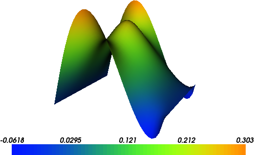

Poisson equation
================

This demo illustrates how to:

* Solve a linear partial differential equation
* Create and apply Dirichlet boundary conditions
* Define Expressions
* Define a FunctionSpace
* Create a SubDomain

The solution for :math:`u` in this demo will look as follows:

Equation and problem definition
-------------------------------

The Poisson equation is the canonical elliptic partial differential
equation.  For a domain :math:`\Omega \subset \mathbb{R}^n` with
boundary :math:`\partial \Omega = \Gamma_{D} \cup \Gamma_{N}`, the
Poisson equation with particular boundary conditions reads:

.. math::
   - \nabla^{2} u &= f \quad {\rm in} \ \Omega, \\
                u &= 0 \quad {\rm on} \ \Gamma_{D}, \\
                \nabla u \cdot n &= g \quad {\rm on} \ \Gamma_{N}. \\

Here, :math:`f` and :math:`g` are input data and :math:`n` denotes the
outward directed boundary normal. The most standard variational form
of Poisson equation reads: find :math:`u \in V` such that

.. math::
   a(u, v) = L(v) \quad \forall \ v \in V,

where :math:`V` is a suitable function space and

.. math::
   a(u, v) &= \int_{\Omega} \nabla u \cdot \nabla v \, {\rm d} x, \\
   L(v)    &= \int_{\Omega} f v \, {\rm d} x
            + \int_{\Gamma_{N}} g v \, {\rm d} s.

The expression :math:`a(u, v)` is the bilinear form and :math:`L(v)`
is the linear form. It is assumed that all functions in :math:`V`
satisfy the Dirichlet boundary conditions (:math:`u = 0 \ {\rm on} \
\Gamma_{D}`).

In this demo, we shall consider the following definitions of the input
functions, the domain, and the boundaries:

* :math:`\Omega = [0,1] \times [0,1]` (a unit square)
* :math:`\Gamma_{D} = \{(0, y) \cup (1, y) \subset \partial \Omega\}` (Dirichlet boundary)
* :math:`\Gamma_{N} = \{(x, 0) \cup (x, 1) \subset \partial \Omega\}` (Neumann boundary)
* :math:`g = \sin(5x)` (normal derivative)
* :math:`f = 10\exp(-((x - 0.5)^2 + (y - 0.5)^2) / 0.02)` (source term)
